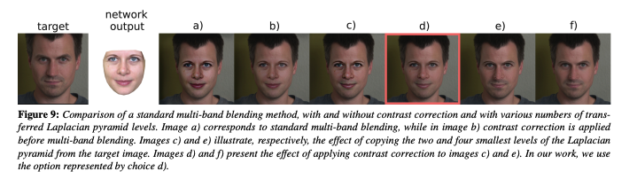

## Modified Laplacian Pyramid Blending

Implementation of Image Blending from [High-Resolution Neural Face Swapping for Visual Effects](https://studios.disneyresearch.com/wp-content/uploads/2020/06/High-Resolution-Neural-Face-Swapping-for-Visual-Effects.pdf#page=5&zoom=100,65,109)



## Usage
```python
import cv2
import numpy as np
from laplacian_pyramid_blend import LaplacianPyramidBlender

img1 = cv2.imread("./images/west_1.jpeg")
img2 = cv2.imread("./images/west_2.jpeg")
mask = cv2.imread("./images/mask.png")

blender = LaplacianPyramidBlender()

composite = blender(img1, img2, mask)

cv2.imwrite("./images/composite.png", composite)
```

## Install
```bash
pip install laplacian-pyramid-blend
```

## Citations
```bibtex
@inproceedings{Naruniec2020NeuralFaceSwap,
    title   = {High-Resolution Neural Face Swapping for Visual Effects},
    author  = {Jacek Naruniec, Leonhard Helminger, Christopher Schroers, Romann M. Weber},
    year    = {2020}
}
```